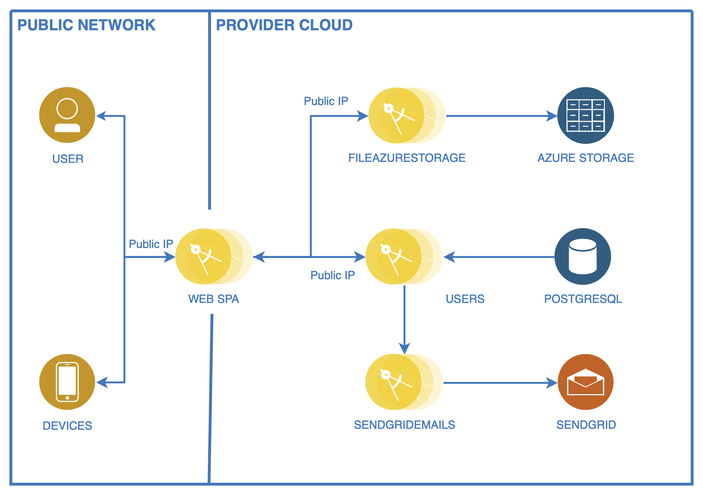

# :house: Mikroservices

Here you can find set of microservices which you can use in your project. Currently available microservices:

- [Users](https://github.com/Mikroservices/Users) - service which is responsible for managing users. Main features:

  - registering new user
  - sign-in user (JWT access token & refresh token)
  - forgot password
  - change password
  - update user data
  - user roles

- [SendGridEmails](https://github.com/Mikroservices/SendGridEmails) - service which is responsible for sending emails via [SendGrid](https://sendgrid.com) service.
- [FileAzureStorage](https://github.com/Mikroservices/FilesAzureStorage) - service which is responsible for storing files in [Azure Blob Storage](https://azure.microsoft.com/en-us/services/storage/blobs/).

Thanks to above services you can build application from below diagram.

You can run multiple instances of each service, and use load balancers to evenly spread network traffic.